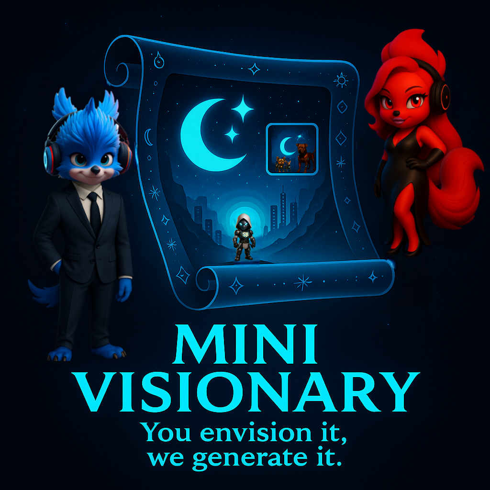

# Mini-Visionary

**You Envision it, We Generate it**

Mini-Visionary is an AI-powered poster generation platform that transforms your imagination into stunning movie-style posters in seconds. From fantasy epics to sci-fi adventures, create professional posters with just a text description.



## ✨ Features

- **AI-Powered Generation**: Advanced AI creates unique, professional posters from text descriptions
- **Multiple Styles**: Fantasy, sci-fi, horror, romance, action, anime - create in any genre you love
- **Personal Library**: Save, organize, and manage all your creations in your private poster library
- **Real-time Chat**: Interactive AI assistant to help with creative ideas and poster concepts
- **User Authentication**: Secure login and account management
- **Credit System**: Fair usage system with credit-based poster generation
- **Ad-Free Options**: Premium subscriptions for uninterrupted creative experience

## 🚀 Live Demo

Visit [Mini-Visionary](https://github.com/TheGamerJay/Mini-Visionary) to see the platform in action.

## 🛠 Tech Stack

### Frontend
- **React 18** with TypeScript
- **Vite** for fast development and building
- **Tailwind CSS** for responsive styling
- **React Router** for navigation
- **Lucide React** for icons

### Backend
- **Python Flask** REST API
- **SQLAlchemy** for database management
- **JWT** authentication
- **OpenAI API** integration for AI poster generation
- **Stripe** for payment processing
- **Resend** for email services

### Infrastructure & Production Features
- **Railway** for deployment
- **SQLite/PostgreSQL** database
- **Docker** containerization
- **Git** version control
- **Brotli/gzip compression** for 60-70% smaller asset sizes
- **Optimized caching** with 1-year cache for hashed assets
- **Security headers** including CSP, XSS protection
- **JSON structured logging** for production monitoring
- **Sentry integration** for error tracking and APM
- **Request correlation** with X-Request-ID headers

## 🏃‍♂️ Quick Start

### Prerequisites
- Node.js 18+ and npm
- Python 3.9+
- OpenAI API key (optional for development)

### Installation

1. **Clone the repository**
   ```bash
   git clone https://github.com/TheGamerJay/Mini-Visionary.git
   cd Mini-Visionary
   ```

2. **Frontend Setup**
   ```bash
   cd frontend
   npm install
   npm run dev
   ```

3. **Backend Setup**
   ```bash
   cd backend
   pip install -r requirements.txt
   python app.py
   ```

4. **Environment Configuration**
   ```bash
   cp .env.example .env
   # Edit .env with your API keys and configuration
   ```

## 📁 Project Structure

```
Mini-Visionary/
├── frontend/                 # React frontend application
│   ├── src/
│   │   ├── components/      # Reusable UI components
│   │   ├── pages/           # Application pages
│   │   ├── hooks/           # Custom React hooks
│   │   └── assets/          # Static assets
│   ├── public/              # Public assets and logo
│   └── package.json
├── backend/                  # Flask backend API
│   ├── app.py              # Main application entry
│   ├── models.py           # Database models
│   ├── auth.py             # Authentication logic
│   └── requirements.txt
├── scripts/                  # Utility scripts
└── docker-compose.yml       # Docker configuration
```

## 🎨 How It Works

1. **Describe Your Vision**: Write a detailed description of your dream poster
2. **AI Creates Magic**: Our AI analyzes your prompt and generates a professional poster
3. **Save & Share**: Customize, save to your library, and share your creations

## 🔧 Configuration

### Environment Variables
```env
# API Configuration
OPENAI_API_KEY=your-openai-api-key
STRIPE_SECRET_KEY=your-stripe-secret-key
RESEND_API_KEY=your-resend-api-key

# Database
DATABASE_URL=your-database-url

# Security
SECRET_KEY=your-secret-key
JWT_SECRET=your-jwt-secret

# CORS
CORS_ORIGINS=https://your-frontend-domain.com

# Observability (Production)
SENTRY_DSN=https://your-sentry-dsn@sentry.io/project-id
ENVIRONMENT=production
GIT_SHA=your-commit-sha
SENTRY_TRACES_SAMPLE_RATE=0.1
SENTRY_PROFILES_SAMPLE_RATE=0.0
```

## 📖 API Documentation

### Authentication Endpoints
- `POST /api/auth/login` - User login
- `POST /api/auth/signup` - User registration
- `POST /api/auth/logout` - User logout
- `GET /api/auth/whoami` - Get current user

### Poster Generation
- `POST /api/poster/generate` - Generate AI poster
- `GET /api/poster/gallery` - Get user's poster gallery

### User Management
- `GET /api/me` - Get user profile
- `PUT /api/me` - Update user profile
- `GET /api/me/credits` - Get user credits

## 🚀 Deployment

### Railway Deployment
1. Connect your GitHub repository to Railway
2. Set environment variables in Railway dashboard
3. Deploy automatically on git push

### Docker Deployment
```bash
docker-compose up -d
```

## 🛡 Security & Performance Features

### Security
- **JWT-based authentication** with secure token management
- **CORS protection** with configurable origins
- **Input validation and sanitization** for all endpoints
- **Rate limiting** to prevent abuse
- **Secure password hashing** with bcrypt
- **Environment variable protection** for sensitive data
- **Content Security Policy (CSP)** headers for XSS protection
- **Anti-clickjacking** with X-Frame-Options

### Performance Optimizations
- **Brotli & gzip compression** (60-70% size reduction)
- **Optimal caching strategy** (1-year cache for hashed assets, no-cache for HTML)
- **Build integration** (npm run build → Flask serves automatically)
- **Source maps disabled** in production for security
- **Asset versioning** with cache-busting hashes

### Observability
- **Structured JSON logging** for production monitoring
- **Sentry error tracking** with automatic exception capture
- **Request correlation IDs** (X-Request-ID) for distributed tracing
- **Performance monitoring** with request timing data
- **APM integration** with configurable sampling rates

## 🤝 Contributing

1. Fork the repository
2. Create your feature branch (`git checkout -b feature/amazing-feature`)
3. Commit your changes (`git commit -m 'Add amazing feature'`)
4. Push to the branch (`git push origin feature/amazing-feature`)
5. Open a Pull Request

## 📝 License

This project is licensed under the MIT License - see the [LICENSE](LICENSE) file for details.

## 🙏 Acknowledgments

- OpenAI for powerful AI capabilities
- React and Flask communities
- All contributors and users of Mini-Visionary

## 📞 Support

- Create an [issue](https://github.com/TheGamerJay/Mini-Visionary/issues) for bug reports
- Join our community discussions
- Email: support@mini-visionary.com

---

**Mini-Visionary** - *You Envision it, We Generate it* ✨